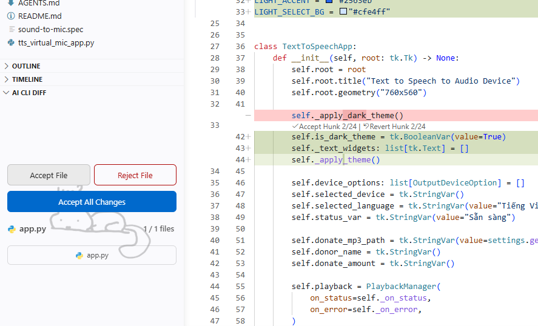
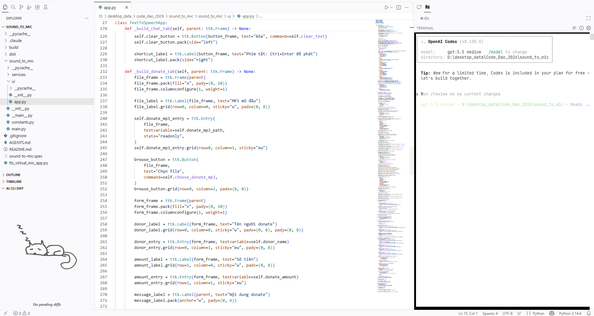
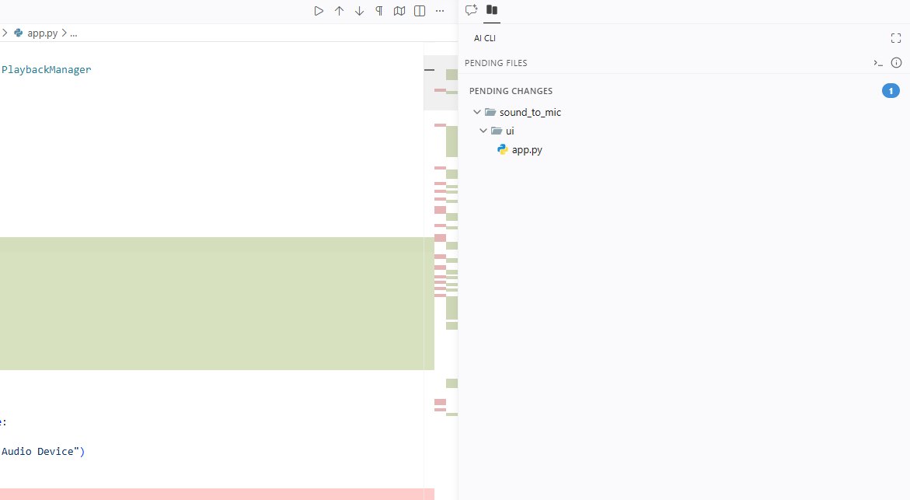
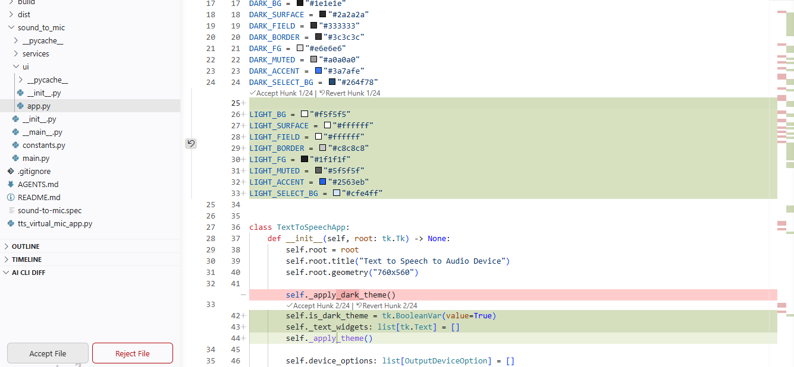
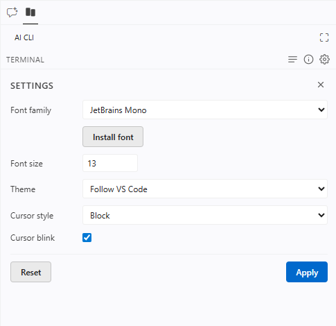

# AI CLI diff view

VS Code extension for reviewing AI CLI file edits as inline diffs inside the editor.

## Features

*Accept or reject each AI change with one click in the side panel.*

---

*Run an AI CLI agent right inside the embedded terminal.*

---

*See changed files in their real folder structure.*

---

*Review changes hunk by hunk directly in the editor.*

---

*Customize terminal font, theme, and cursor from the Settings popover.*

## Usage

1. Click `Install Hooks` in the AI CLI sidebar to wire your AI CLI into the extension.
2. Run your AI CLI workflow in the embedded terminal (or externally).
3. Review pending diffs directly inside VS Code — accept or revert hunk by hunk.

