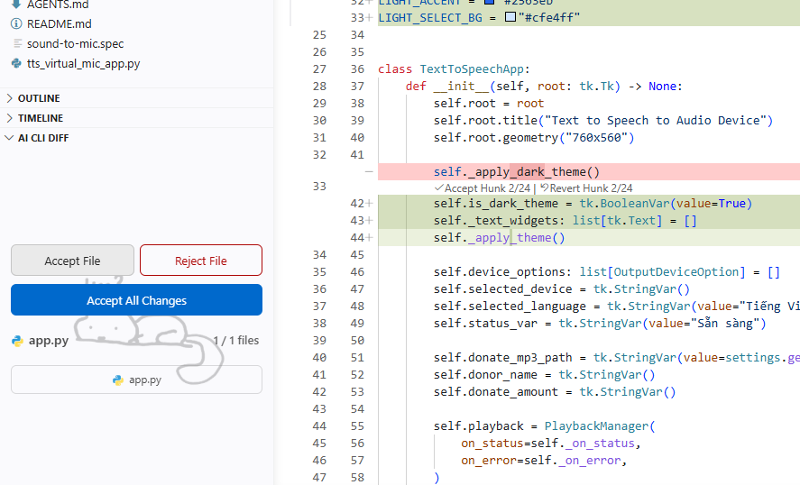
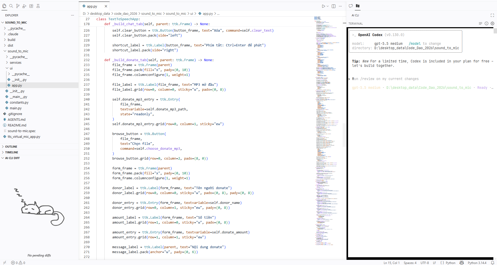
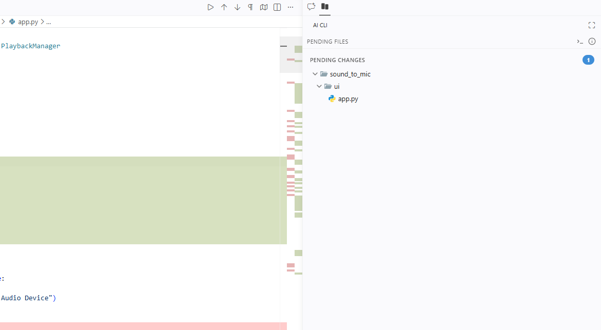
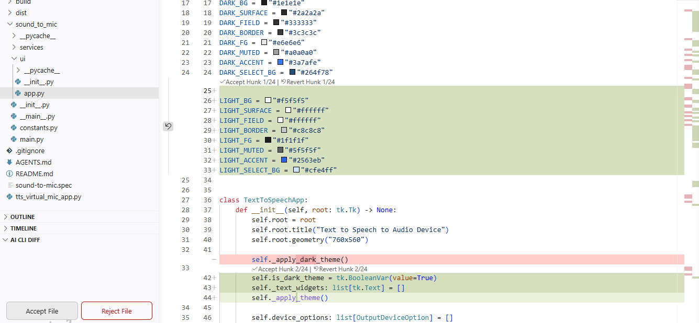
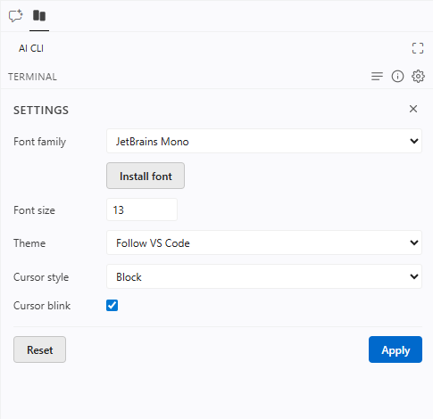

# AI CLI Diff View

Cursor-like inline diff review for any AI CLI agent's file edits — right inside VS Code.

Works with any AI CLI tool out of the box (Claude, Codex, Qwen, and more) — no setup, no hooks required. Review, accept, or revert changes without ever leaving VS Code.

## Features


*Welcome to AI CLI Diff — review every AI edit before it lands.*

---



*Accept or reject each AI change with one click in the side panel.*

---



*Run an AI CLI agent right inside the embedded terminal.*

---



*See changed files in their real folder structure.*

---



*Review changes hunk by hunk directly in the editor.*

---



*Customize terminal font, theme, and cursor from the Settings popover.*

## Usage

1. Open the `AI CLI` sidebar in VS Code.
2. Run an AI CLI agent — Claude, Codex, Qwen, or anything else — in the integrated terminal or an external terminal. Edits are picked up automatically, no setup needed.
3. View pending diffs in VS Code.
4. Accept or revert changes per hunk, per file, or all pending changes at once.

## Commands

- `AI CLI Diff: Start Claude Session`
- `AI CLI Diff: Accept All Changes`
- `AI CLI Diff: Accept All Changes (All Files)`
- `AI CLI Diff: Revert All Changes`
- `AI CLI Diff: Open Pending File`
- `AI CLI Diff: Previous Edited File`
- `AI CLI Diff: Next Edited File`

## Keybindings

- `Ctrl+Shift+A` / `Cmd+Shift+A` on macOS: Start a Claude session.
- `Ctrl+Shift+Y` / `Cmd+Shift+Y` on macOS: Accept all changes in the current diff.
- `Ctrl+Shift+Z` / `Cmd+Shift+Z` on macOS: Revert all changes in the current diff.
- `Alt+H`: Navigate to the previous edited file while pending diffs exist.
- `Alt+L`: Navigate to the next edited file while pending diffs exist.

## Development

```bash
npm install
npm run compile
```

Press `F5` in VS Code to launch the Extension Development Host.

Package the extension:

```bash
npx @vscode/vsce package
```

## License

MIT
