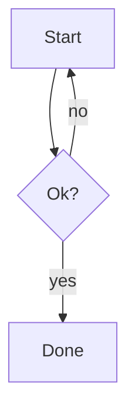

# Preview sample

Relative image: 

| Name | Qty |
| ---- | --- |
| a    | 1   |
| b    | 2   |

- [x] task list
- [ ] open item

```mermaid
graph TD;
  A[Start] --> B{Ok?};
  B -- yes --> C[Done];
  B -- no --> A;
```

[bad](javascript:alert(1)) and [anchor](#preview-sample)
