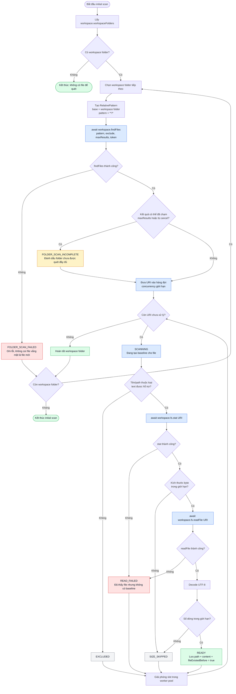

# VS Code API baseline scan activity

Activity diagram này chỉ mô tả nhánh quét file ban đầu bằng VS Code API. Luồng
watcher và xử lý diff không nằm trong phạm vi của sơ đồ.



## Trạng thái đầu ra của nhánh scan

| Trạng thái | Ý nghĩa |
| --- | --- |
| `READY` | Đã đọc được baseline; file chắc chắn tồn tại trước các thay đổi tiếp theo. |
| `EXCLUDED` | File không thuộc loại/path cần theo dõi. |
| `SIZE_SKIPPED` | File vượt giới hạn byte hoặc số dòng. |
| `READ_FAILED` | Discovery thấy file nhưng không thể đọc metadata/content. |
| `FOLDER_SCAN_INCOMPLETE` | Scan bị cancel hoặc chạm giới hạn kết quả; không được suy luận file không xuất hiện là file mới. |
| `FOLDER_SCAN_FAILED` | `findFiles()` thất bại cho workspace folder đó. |

## API được sử dụng

```ts
const pattern = new vscode.RelativePattern(folder, '**/*');
const uris = await vscode.workspace.findFiles(
  pattern,
  exclude,
  maxResults,
  cancellationToken
);

const stat = await vscode.workspace.fs.stat(uri);
const bytes = await vscode.workspace.fs.readFile(uri);
```

`findFiles()` trả về toàn bộ mảng URI sau khi tìm xong, vì vậy bước đọc content
phải dùng worker pool/concurrency giới hạn thay vì `Promise.all()` toàn bộ file.
